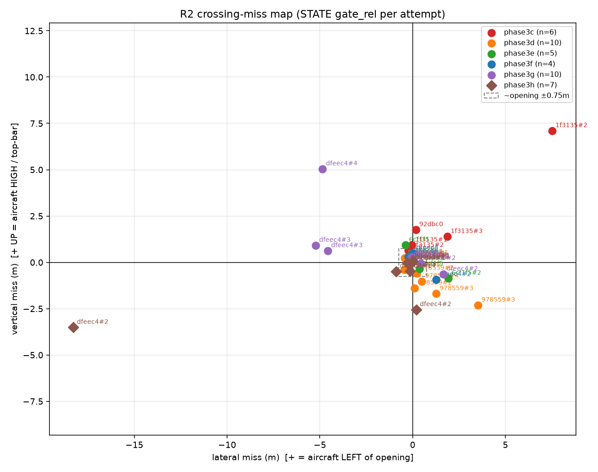

# Crossing-miss map (phase3c–3i convergence dashboard)

Generated by `analysis/2026-07-15-crossing-miss-map/run_crossing_miss_map.py`.
Miss vectors from **STATE `gate_rel`** (lock-accepted / dead-reckoned), **not** raw detections (which include lock-rejected fixes).

Convention at closest approach:
- **lateral_m** = cam `t_x` (body y): + = opening RIGHT of aircraft = aircraft LEFT of opening
- **vertical_m** = cam `t_y` (body z, down+): + = opening BELOW aircraft = aircraft HIGH / top-bar

Phase3h+ **retry cycles**: each `approach→commit→(retreat)?` segmented via `setpoint.data.phase` is a separate row (`att` column). Earlier phases usually have one attempt per flight.

## Miss table (every R2 attempt)

| phase | flight | att | cycle | status | closest dist (m) | lateral (m) | vertical (m) | age (s) | gates | result |
|---|---|---:|---|---|---:|---:|---:|---:|---:|---|
| phase3c | `20260715T044545-411f3135` | 1/1 | `—` | no_gate_rel | — | — | — | — | 0 | flight timeout |
| phase3c | `20260715T045100-411f3135` | 1/1 | `approach+commit+approach+recover` | ok | 1.12 | -0.05 | +0.93 | 1.21 | 0 | environment collision (impulse=1.2) |
| phase3c | `20260715T045458-411f3135` | 1/2 | `approach+commit+approach+commit+recover` | ok | 0.17 | -0.01 | +0.12 | 1.09 | 0 | environment collision (impulse=5.2) |
| phase3c | `20260715T045458-411f3135` | 2/2 | `approach` | ok | 10.76 | +1.86 | +1.39 | 0.54 | 0 | environment collision (impulse=5.2) |
| phase3c | `20260715T051458-6092dbc0` | 1/1 | `approach` | ok | 2.02 | +0.17 | +1.76 | 1.19 | 0 | environment collision (impulse=17.5) |
| phase3d | `20260715T121747-22978559` | 1/2 | `approach+commit+approach` | ok | 0.36 | -0.10 | +0.23 | 1.02 | 0 | environment collision (impulse=28.5) |
| phase3d | `20260715T121747-22978559` | 2/2 | `approach` | ok | 9.29 | +1.26 | -1.69 | 1.18 | 0 | environment collision (impulse=28.5) |
| phase3d | `20260715T122040-22978559` | 1/2 | `approach+commit+approach+commit` | ok | 1.34 | +0.21 | -0.59 | 1.49 | 0 | environment collision (impulse=1.2) |
| phase3d | `20260715T122040-22978559` | 2/2 | `approach` | ok | 5.78 | +3.52 | -2.31 | 0.01 | 0 | environment collision (impulse=1.2) |
| phase3d | `20260715T122352-22978559` | 1/2 | `approach+commit+approach` | ok | 0.18 | -0.14 | +0.10 | 1.19 | 0 | environment collision (impulse=3.7) |
| phase3d | `20260715T122352-22978559` | 2/2 | `approach+commit+approach+commit` | ok | 0.13 | -0.03 | -0.01 | 1.24 | 0 | environment collision (impulse=3.7) |
| phase3e | `20260715T183716-8e6cf1f5` | 1/1 | `approach` | ok | 2.46 | -0.38 | +0.94 | 1.19 | 0 | environment collision (impulse=2.5) |
| phase3e | `20260715T184758-8e6cf1f5` | 1/1 | `approach+recover` | ok | 3.11 | +0.37 | -0.35 | 1.09 | 0 | stale channels: frame |
| phase3e | `20260715T185046-8e6cf1f5` | 1/1 | `approach+commit+approach+recover` | ok | 1.45 | -0.06 | -0.02 | 1.21 | 0 | environment collision (impulse=1.3) |
| phase3e | `20260715T185843-7f28e2fb` | 1/1 | `approach` | ok | 2.87 | -0.11 | +0.38 | 1.18 | 0 | environment collision (impulse=3.0) |
| phase3f | `20260715T195033-8edfeec4` | 1/1 | `approach+commit+approach+recover` | ok | 1.53 | -0.24 | +0.30 | 1.20 | 0 | environment collision (impulse=4.2) |
| phase3f | `20260715T200011-8edfeec4` | 1/1 | `approach+recover` | ok | 2.59 | +0.01 | +0.51 | 1.19 | 0 | environment collision (impulse=1.9) |
| phase3f | `20260715T200142-8edfeec4` | 1/1 | `approach` | ok | 2.04 | -0.09 | +0.20 | 1.26 | 0 | environment collision (impulse=2.4) |
| phase3g | `20260715T203300-8edfeec4` | 1/2 | `approach+commit+recover` | ok | 1.27 | +0.04 | +0.06 | 1.19 | 0 | environment collision (impulse=10.1) |
| phase3g | `20260715T203300-8edfeec4` | 2/2 | `approach+commit+approach` | ok | 0.45 | +0.44 | -0.06 | 1.20 | 0 | environment collision (impulse=10.1) |
| phase3g | `20260715T204925-8edfeec4` | 1/3 | `approach+commit+approach` | ok | 1.98 | -0.12 | +0.19 | 1.19 | 0 | environment collision (impulse=5.1) |
| phase3g | `20260715T204925-8edfeec4` | 2/3 | `approach` | ok | 31.23 | -5.23 | +0.92 | 1.49 | 0 | environment collision (impulse=5.1) |
| phase3g | `20260715T204925-8edfeec4` | 3/3 | `approach` | ok | 33.32 | -4.86 | +5.05 | 1.24 | 0 | environment collision (impulse=5.1) |
| phase3g | `20260715T205124-8edfeec4` | 1/1 | `approach+commit` | ok | 1.84 | -0.08 | +0.29 | 1.19 | 0 | environment collision (impulse=1.2) |
| phase3g | `20260715T205845-fc86a160` | 1/1 | `approach+commit+approach+commit` | ok | 0.05 | -0.05 | +0.02 | 1.10 | 0 | environment collision (impulse=9.3) |
| phase3h | `20260715T213138-8edfeec4` | 1/1 | `approach+commit+retreat` | ok | 1.34 | -0.14 | -0.47 | 0.26 | 0 | gate clip budget exceeded (11) |
| phase3h | `20260715T213225-8edfeec4` | 1/2 | `approach+commit+retreat` | ok | 0.72 | -0.12 | -0.05 | 1.21 | 0 | environment collision (impulse=2.5) |
| phase3h | `20260715T213225-8edfeec4` | 2/2 | `approach` | ok | 29.31 | -18.28 | -3.51 | 0.01 | 0 | environment collision (impulse=2.5) |
| phase3h | `20260715T213406-fc86a160` | 1/2 | `approach+commit+retreat` | ok | 0.21 | +0.02 | +0.06 | 1.20 | 0 | environment collision (impulse=25.5) |
| phase3h | `20260715T213406-fc86a160` | 2/2 | `approach` | ok | 3.37 | -0.29 | -0.03 | 1.20 | 0 | environment collision (impulse=25.5) |
| phase3h | `20260716T022502-8edfeec4` | 1/2 | `approach+commit+retreat` | ok | 1.33 | -0.88 | -0.49 | 0.23 | 0 | environment collision (impulse=7.6) |
| phase3h | `20260716T022502-8edfeec4` | 2/2 | `approach` | ok | 8.99 | +0.20 | -2.55 | 0.03 | 0 | environment collision (impulse=7.6) |

## Phase summary (ok attempts with closest dist ≤ 5 m)

Far retries / search flails remain in the table above but are excluded here and from the scatter so the convergence chart stays readable.

| phase | n | mean |lat| | mean lat | mean vert | mean |vert| | rms miss |
|---|---:|---:|---:|---:|---:|---:|
| phase3c | 3 | 0.07 | +0.04 | +0.94 | 0.94 | 1.16 |
| phase3d | 4 | 0.12 | -0.01 | -0.07 | 0.23 | 0.35 |
| phase3e | 4 | 0.23 | -0.05 | +0.24 | 0.42 | 0.60 |
| phase3f | 3 | 0.11 | -0.10 | +0.34 | 0.34 | 0.39 |
| phase3g | 5 | 0.15 | +0.05 | +0.10 | 0.12 | 0.26 |
| phase3h | 5 | 0.29 | -0.28 | -0.20 | 0.22 | 0.52 |

## Phase3h retry spotlight

Each flight may have multiple attempts (retreat-and-retry). Misses below are per attempt — not collapsed to one closest-overall.

- `20260715T213138-8edfeec4`: 1 attempt(s)
  - att 1: dist=1.34 m, lat=-0.14, vert=-0.47, age=0.26s, cycle=`approach+commit+retreat` → retreated
- `20260715T213225-8edfeec4`: 2 attempt(s)
  - att 1: dist=0.72 m, lat=-0.12, vert=-0.05, age=1.21s, cycle=`approach+commit+retreat` → retreated
  - att 2: dist=29.31 m, lat=-18.28, vert=-3.51, age=0.01s, cycle=`approach`
- `20260715T213406-fc86a160`: 2 attempt(s)
  - att 1: dist=0.21 m, lat=+0.02, vert=+0.06, age=1.20s, cycle=`approach+commit+retreat` → retreated
  - att 2: dist=3.37 m, lat=-0.29, vert=-0.03, age=1.20s, cycle=`approach`
- `20260716T022502-8edfeec4`: 2 attempt(s)
  - att 1: dist=1.33 m, lat=-0.88, vert=-0.49, age=0.23s, cycle=`approach+commit+retreat` → retreated
  - att 2: dist=8.99 m, lat=+0.20, vert=-2.55, age=0.03s, cycle=`approach`

## Scatter

Origin = gate opening center. Points = STATE closest approach **per attempt** (closest dist ≤ 5 m). Ideal pass sits near (0,0). Right/up = aircraft LEFT / HIGH. Labels: flight hex; `#N` when a flight has multiple attempts. Far retries stay in the table only.

## Close-range PnP outlier autopsy (2–4.5 m)

Raw detections (for autopsy only). Looking for |ty|>=2 m. Frames matched by detection ts_ns; start slices rejected if they do not cover the outlier time.

| phase | flight | t (s) | dist (m) | ty (m) | Δty | reason | frame |
|---|---|---:|---:|---:|---:|---|---|
| phase3d | `20260715T122352-22978559` | 14.50 | 4.43 | -2.86 | — | |ty|=2.86m at 4.43m | pnp_outliers/phase3d_978559_t14.5_ty-2.9.jpg |
| phase3h | `20260715T213406-fc86a160` | 7.45 | 4.49 | -2.86 | — | |ty|=2.86m at 4.49m | pnp_outliers/phase3h_86a160_t7.5_ty-2.9.jpg |
| phase3g | `20260715T203300-8edfeec4` | 10.60 | 4.42 | -2.70 | — | |ty|=2.70m at 4.42m | pnp_outliers/phase3g_dfeec4_t10.6_ty-2.7.jpg |
| phase3d | `20260715T122040-22978559` | 7.08 | 4.01 | -2.53 | 0.72 | |ty|=2.53m at 4.01m | pnp_outliers/phase3d_978559_t7.1_ty-2.5.jpg |
| phase3g | `20260715T205124-8edfeec4` | 7.37 | 4.45 | -2.37 | — | |ty|=2.37m at 4.45m | pnp_outliers/phase3g_dfeec4_t7.4_ty-2.4.jpg |
| phase3h | `20260716T022502-8edfeec4` | 13.39 | 4.17 | -2.34 | — | |ty|=2.34m at 4.17m | pnp_outliers/phase3h_dfeec4_t13.4_ty-2.3.jpg |
| phase3f | `20260715T195033-8edfeec4` | 6.95 | 4.42 | -2.14 | 0.12 | |ty|=2.14m at 4.42m | pnp_outliers/phase3f_dfeec4_t7.0_ty-2.1.jpg |
| phase3g | `20260715T205845-fc86a160` | 12.93 | 3.28 | -2.06 | — | |ty|=2.06m at 3.28m | pnp_outliers/phase3g_86a160_t12.9_ty-2.1.jpg |

### What the detector saw

- `phase3d_978559_t14.5_ty-2.9.jpg` frames UNAVAILABLE at outlier t=14.50s (ts_ns=1784118260518789700). Best candidate `20260715T122352-22978559_r2d_slice_start.aigprec` rejected: best_err 13.331s > 0.080s (recording does not cover outlier) (duration~1.17s). Attached schematic from detection corners_px/center_px. |ty|=2.86m at 4.43m. corners_px=[[255.0, 72.0], [385.0, 47.0], [395.0, 154.0], [291.0, 165.0]]; center_px=[331.5,109.5]; edges top/bot/L/R=132/105/100/107; trap=0.23 PnP normal=[-0.08874882851254678, 0.9606752649681918, -0.2631096363038515] VERDICT: bad PnP / wrong quad - normal y-dominant (implausible for face-on ring). strong trapezoid - steep perspective or partial ring.
- `phase3h_86a160_t7.5_ty-2.9.jpg` frames UNAVAILABLE at outlier t=7.45s (ts_ns=1784151268594198800). Best candidate `20260715T213406-fc86a160_r2h_slice_start.aigprec` rejected: best_err 6.298s > 0.080s (recording does not cover outlier) (duration~1.15s). Attached schematic from detection corners_px/center_px. |ty|=2.86m at 4.49m. corners_px=[[262.0, 56.0], [382.0, 71.0], [345.0, 190.0], [246.0, 164.0]]; center_px=[308.8,120.2]; edges top/bot/L/R=121/102/109/125; trap=0.17 PnP normal=[-0.21020914077269612, 0.46328594006339063, -0.8609171010470086] VERDICT: ring-like quad but |ty| implies ~32deg at 4.5m - lock-rejected pose blow-up (banner/other-gate/partial), not true opening offset.
- `phase3g_dfeec4_t10.6_ty-2.7.jpg` frames UNAVAILABLE at outlier t=10.60s (ts_ns=1784147604649372200). Best candidate `20260715T203300-8edfeec4_r2g_slice_start.aigprec` rejected: best_err 9.464s > 0.080s (recording does not cover outlier) (duration~1.14s). Attached schematic from detection corners_px/center_px. |ty|=2.70m at 4.42m. corners_px=[[334.0, 86.0], [422.0, 43.0], [479.0, 181.0], [352.0, 175.0]]; center_px=[396.8,121.2]; edges top/bot/L/R=98/127/91/149; trap=0.26 PnP normal=[-0.5641153437672743, 0.7089171970539818, -0.4233323595562422] VERDICT: bad PnP / wrong quad - normal y-dominant (implausible for face-on ring). strong trapezoid - steep perspective or partial ring.
- `phase3d_978559_t7.1_ty-2.5.jpg` frames UNAVAILABLE at outlier t=7.08s (ts_ns=1784118061039329800). Best candidate `20260715T122040-22978559_r2d_slice_start.aigprec` rejected: best_err 5.937s > 0.080s (recording does not cover outlier) (duration~1.14s). Attached schematic from detection corners_px/center_px. |ty|=2.53m at 4.01m. corners_px=[[216.0, 61.0], [341.0, 62.0], [353.0, 182.0], [214.0, 187.0]]; center_px=[281.0,123.0]; edges top/bot/L/R=125/139/126/121; trap=0.11 PnP normal=[0.12151406349795744, 0.2834592568364985, -0.9512545306519776] VERDICT: ring-like quad but |ty| implies ~32deg at 4.0m - lock-rejected pose blow-up (banner/other-gate/partial), not true opening offset.
- `phase3g_dfeec4_t7.4_ty-2.4.jpg` frames UNAVAILABLE at outlier t=7.37s (ts_ns=1784148705266914200). Best candidate `20260715T205124-8edfeec4_r2g_slice_start.aigprec` rejected: best_err 6.000s > 0.080s (recording does not cover outlier) (duration~1.36s). Attached schematic from detection corners_px/center_px. |ty|=2.37m at 4.45m. corners_px=[[308.0, 103.0], [433.0, 98.0], [422.0, 210.0], [314.0, 215.0]]; center_px=[369.2,156.5]; edges top/bot/L/R=125/108/112/113; trap=0.15 PnP normal=[0.03994847980224759, 0.7614485044055758, -0.6469932720670294] VERDICT: bad PnP / wrong quad - normal y-dominant (implausible for face-on ring).
- `phase3h_dfeec4_t13.4_ty-2.3.jpg` frames UNAVAILABLE at outlier t=13.39s (ts_ns=1784168731065237200). Best candidate `20260716T022502-8edfeec4_r2h_slice_start.aigprec` rejected: best_err 12.004s > 0.080s (recording does not cover outlier) (duration~1.40s). Attached schematic from detection corners_px/center_px. |ty|=2.34m at 4.17m. corners_px=[[490.0, 17.0], [639.0, 0.0], [639.0, 167.0], [507.0, 171.0]]; center_px=[568.8,88.8]; edges top/bot/L/R=150/132/155/167; trap=0.13 PnP normal=[0.1388497005436027, 0.5080007204880762, -0.8500917765997664] VERDICT: ring-like quad but |ty| implies ~29deg at 4.2m - lock-rejected pose blow-up (banner/other-gate/partial), not true opening offset. quad center high in frame. quad near L/R edge (partial/off-axis).
- `phase3f_dfeec4_t7.0_ty-2.1.jpg` frames UNAVAILABLE at outlier t=6.95s (ts_ns=1784145054115956500). Best candidate `20260715T195033-8edfeec4_r2f_slice_start.aigprec` rejected: best_err 5.599s > 0.080s (recording does not cover outlier) (duration~1.37s). Attached schematic from detection corners_px/center_px. |ty|=2.14m at 4.42m. corners_px=[[366.0, 133.0], [503.0, 82.0], [528.0, 205.0], [405.0, 227.0]]; center_px=[450.5,161.8]; edges top/bot/L/R=146/125/102/126; trap=0.16 PnP normal=[-0.2459045791108058, 0.8238621139334973, -0.5106683416830992] VERDICT: bad PnP / wrong quad - normal y-dominant (implausible for face-on ring).
- `phase3g_86a160_t12.9_ty-2.1.jpg` frames UNAVAILABLE at outlier t=12.93s (ts_ns=1784149153473635000). Best candidate `20260715T205845-fc86a160_r2g_slice_start.aigprec` rejected: best_err 10.571s > 0.080s (recording does not cover outlier) (duration~2.41s). Attached schematic from detection corners_px/center_px. |ty|=2.06m at 3.28m. corners_px=[[0.0, 0.0], [223.0, 5.0], [207.0, 158.0], [0.0, 168.0]]; center_px=[107.5,82.8]; edges top/bot/L/R=223/207/168/154; trap=0.07 PnP normal=[0.19509656849001422, 0.13742901916081343, -0.9711079207049635] VERDICT: ring-like quad but |ty| implies ~32deg at 3.3m - lock-rejected pose blow-up (banner/other-gate/partial), not true opening offset. quad center high in frame. quad near L/R edge (partial/off-axis).

## Reading the convergence

- **phase3c→3d** (mount_pitch=29): vertical should shrink if altitude phantom died.
- **phase3e** (slow): both axes may shrink via phantom starvation.
- **phase3f** (cross-track): lateral |mean| should drop vs 3e.
- **phase3g** (altitude hold): vertical residual is the target if present.
- **phase3h** (age-aware lock + retreat-and-retry): multiple points per flight; did retries improve the miss?
- **phase3i**: include when fixture lands.

## Deliverables

- `report.md`, `summary.json`, `miss_table.csv`
- `plots/miss_scatter.png`
- `pnp_outliers/` annotated frames

---

## Extension (2026-07-16 milestone)

phase3i + phase3j-rerun + PASS star: see `analysis/2026-07-16-milestone-autopsy/report.md`.
