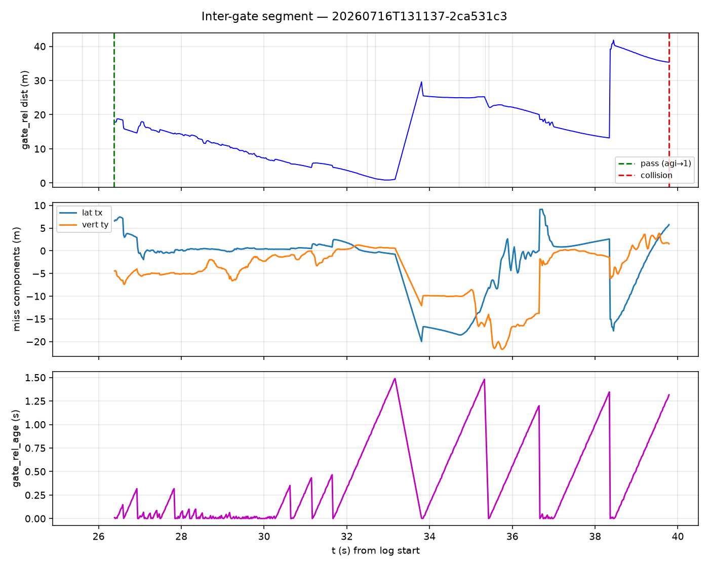

# Milestone autopsy + inter-gate frontier

AGENTS.md DATA ANALYST CURRENT TASK (HEAD ≥ `3d37d99`).
Milestone flight: `20260716T131137-2ca531c3` in `fixtures/20260716T132549-phase3j-r2training-rerun`.

## 1. Crossing-miss map extension (phase3i + phase3j-rerun + PASS)

See `miss_map_extension.md`, `miss_table.csv`, `plots/miss_scatter_with_pass.png`.

### PASS crossing vector (first ground-truth success)

| field | value |
|---|---|
| closest dist | **0.103 m** |
| lateral | **+0.006 m** ( + = aircraft LEFT ) |
| vertical | **+0.100 m** ( + = aircraft HIGH ) |
| gate_rel_age | 1.08 s |
| cycle | `approach+commit+approach+commit+retreat` |

### New phases at a glance (ok, dist≤5m)

| phase | n | mean lat | mean vert | rms |
|---|---:|---:|---:|---:|
| phase3i | 3 | -0.03 | +0.14 | 0.16 |
| phase3j_rerun | 5 | -0.03 | +0.06 | 0.25 |

## 2. Inter-gate segment study (pass → collision)

### Timeline corrections vs AGENTS.md wording

| AGENTS.md | Measured on log |
|---|---|
| pass t≈25.4 | **agi 0→1 at t=26.371s**; closest STATE at t=26.2251324s |
| commit→retreat t≈31.6 | **[(32.4854292, 'commit'), (32.6850963, 'retreat'), (34.7055027, 'approach'), (35.3454404, 'search'), (35.4255074, 'approach')]** |
| collision t≈38.9 | **t=39.787s** impulse=15.537909507751465 |

### Gate-2 lock quality

- Inter-gate STATE samples: **636**
- Mean `gate_rel_age_s`: **0.4103572022515723**
- Max age: **1.488557856**
- After the pass the pipeline re-arms on a far gate (~18 m). Approach closes range to ~2–4 m by t≈32, then a **0.20 s commit** flips to **retreat** (age≈1.0 s — stale lock / corridor breach), backs off, re-approaches, then wanders with lock jumps (dist 14→40 m) before the hard env hit.

### Brief commit→retreat

Measured cycle (not 31.6):

- t=32.485s → `commit`
- t=32.685s → `retreat`
- t=34.706s → `approach`
- t=35.345s → `search`
- t=35.426s → `approach`

Interpretation: gate-2 attempt aborted almost immediately — age-aware lock was already stale (~0.8–1.0 s) at commit entry; retreat fired, then the second approach never re-acquired a clean close lock before the obstacle strike.

### What did it hit?

**Correction:** operator `f4_late.jpg` / `f4_end.jpg` are **not** sim FPV (pause menu / terminal UI -- `f4_late` is ~37% red UI chrome). Collision ID must come from `vision.aigprec`.

Extracted FPV frames (`_extract_hit.py` -> `collision_frames/vision_t*.jpg`, flight-t relative to first log `mono_ns`):

| tgt | t | err | cyan_frac | center80 bright | note |
|---|---:|---:|---:|---:|---|
| 26.4 pass | 26.392 | 0.008 | 0.0050 | 28.8 | through gate 1 |
| 32.5 commit | 32.502 | 0.002 | 0.0000 | 38.7 | gate-2 commit |
| 33.0 retreat | 33.001 | 0.001 | 0.0000 | 10.5 | backing off |
| 35.5 | 35.500 | 0.000 | 0.0000 | 43.7 | still some scene detail |
| 37.5 | 37.499 | 0.001 | 0.0000 | 22.2 | dark mass growing |
| 38.5 | 38.501 | 0.001 | 0.0000 | 18.0 | strong horizontal edge on right |
| 39.5 | 39.499 | 0.001 | 0.0000 | 0.8 | FOV nearly black |
| 39.79 collision | 39.790 | 0.000 | 0.0000 | 3.7 | impulse 15.5 |

**Visual ID from FPV near t=39.5-39.8:** the camera flies into a **large dark surface that fills the FOV** (center 80x80 brightness ~1-4; >90% of pixels near-black). This is **not a thin pillar/column** -- a freestanding pillar would leave lit hangar scene on one or both sides; here the dark mass occludes almost the entire frame. At t~38.5 a broad **horizontal edge** cuts across the right FOV, then the view goes black as range closes -- consistent with the face/underside of a **large structure** (parked-aircraft scale or hangar wall/obstacle slab), not a vertical column. Underexposure at contact prevents a confident aircraft-vs-wall paint-job ID; **exclude pillar**.

Kinematics agree: last-second `gate_rel` dist jump ~14m->40m (lock switch) while flying straight -- obstacle was never in the gate model.

Vision coverage: 4512 assembled frames, flight_t ~17.75-39.99 s (covers pass + collision).

## 3. Cyan line as obstacle-free corridor (phase4b input)

HSV bands (from R2 deep-dive): H∈[90,98], S≥120, V≥120.

### Recording windows

| label | frames | cyan-present% | mean frac | max absent gap (s) |
|---|---:|---:|---:|---:|
| `pass_full_local` | 4512 | 53.8 | 0.0074 | 8.02 |
| `pass_intergate` | 2559 | 26.0 | 0.0022 | 7.81 |
| `pass_pre_pass` | 1687 | 95.5 | 0.0149 | 0.21 |
| `slice_203252-phase3a-r2tr_2_f2_slice_start` | 111 | 100.0 | 0.0334 | 0.00 |
| `slice_115732-phase3i-r2tr__r2i_slice_start` | 198 | 100.0 | 0.0292 | 0.00 |
| `slice_132549-phase3j-r2tr_erun_slice_start` | 290 | 100.0 | 0.0343 | 0.00 |

### Operator screens (not FPV -- UI only; ignore for cyan/obstacle ID)

- `f4_mid.jpg`: cyan_frac=0.0000 (absent/weak)
- `f4_late.jpg`: cyan_frac=0.0013 (absent/weak)
- `f4_end.jpg`: cyan_frac=0.0003 (absent/weak)

### Verdict (phase4b navigation design)

**NO -- not continuously segmentable in this window** (present 26% of `pass_intergate` 2559 frames). Inter-gate recording exists; cyan drops out for multi-second gaps -- do not bet phase4b on cyan-only follow.

Would following the line have avoided the hit?

- We **do** have inter-gate vision: `pass_intergate` = **2559 frames** from pass->collision with cyan present on **26%** of frames (mean frac 0.0022; max absent gap ~7.8 s). Cyan is **not** continuous through the corridor -- it drops out for multi-second stretches, including the final approach where FPV cyan_frac=0 from t~32.5 through the hit.
- So: following cyan when visible might have helped earlier in the segment, but it would **not** have steered clear at the collision itself (line absent in FPV for ~7 s before impact). Phase4b needs a fallback when the ribbon disappears -- cyan-only is insufficient. Kinematically the hit remains a straight-line chase after the failed gate-2 commit/retreat.

## Deliverables

- `report.md` (this file)
- `miss_map_extension.md`, `miss_table.csv`, `plots/miss_scatter_with_pass.png`
- `intergate_summary.json`, `plots/intergate_kinematics.png`, `collision_frames/`
- `cyan_corridor_summary.json`, `cyan_frames/`, `plots/cyan_timeline_*.png`
- Shared miss-map refresh: `analysis/2026-07-15-crossing-miss-map/miss_table.csv` + scatter
