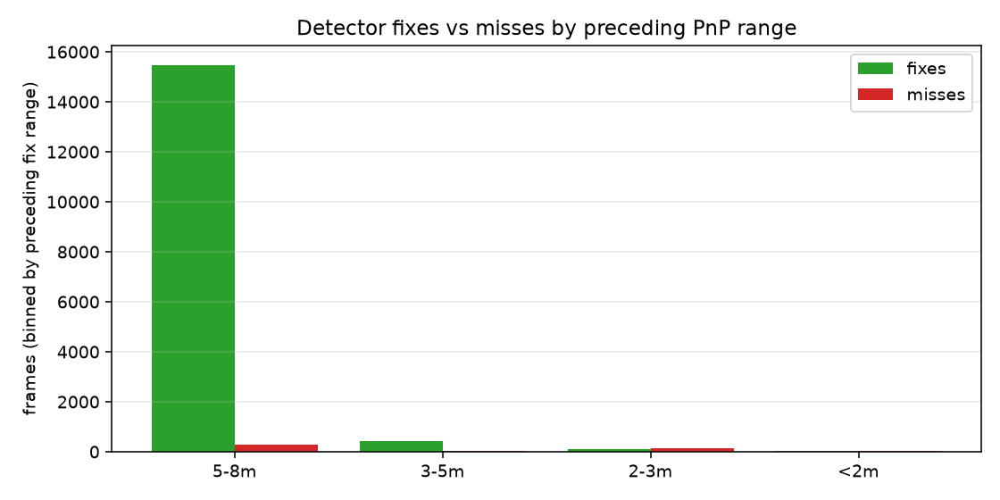
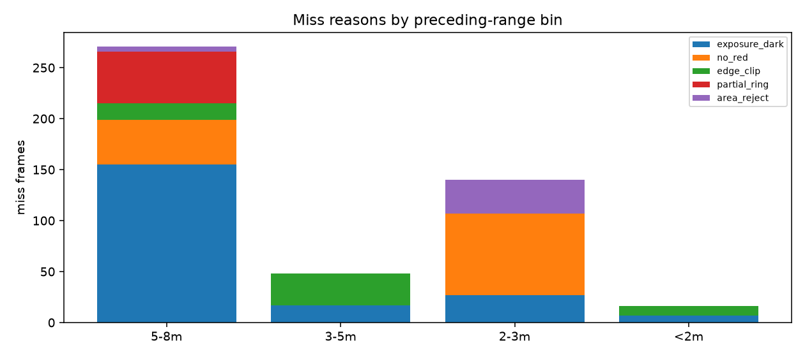
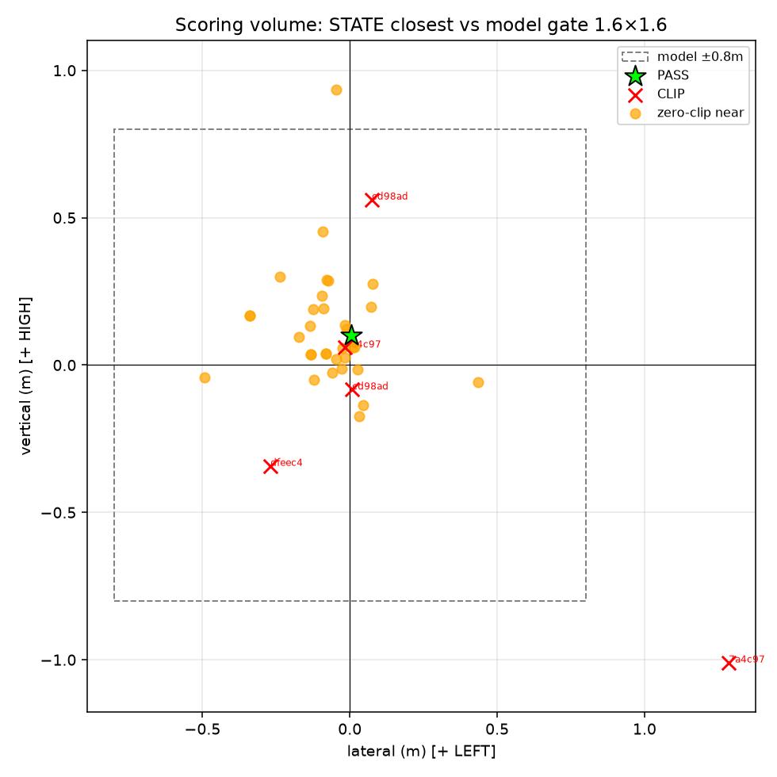

# Phase 5 — close-range perception + true gate size

AGENTS.md DATA ANALYST Phase 5 (HEAD ≥ `9fe3702`).
Harness: `reflight_ext.py` (extends `scripts/reflight.py`, fixes `read_recording` unpack) + `run_phase5_study.py`.

## 1. Why detection stops below ~5 m

Frames are binned by the **nearest preceding PnP fix range** (5–8 / 3–5 / 2–3 / <2 m). A miss in the 3–5 m bin means: we had a fix near that range, then subsequent frames produced no detection.

### Aggregate (all R2 sources)

| preceding bin | frames | fixes | misses | fix rate | top miss reasons |
|---|---:|---:|---:|---:|---|
| 5-8m | 15755 | 15484 | 271 | 98.3% | exposure_dark:155, partial_ring:51, no_red:44, edge_clip:16 |
| 3-5m | 473 | 425 | 48 | 89.9% | edge_clip:31, exposure_dark:17 |
| 2-3m | 236 | 96 | 140 | 40.7% | no_red:80, area_reject:33, exposure_dark:27 |
| <2m | 64 | 48 | 16 | 75.0% | edge_clip:9, exposure_dark:7 |

### Minimum fix range per source (detector produced a PnP)

| source | frames | fixes | min fix range (m) |
|---|---:|---:|---:|
| `local_full/20260716T131137-2ca531c3` | 4512 | 2611 | 1.15 |
| `local_full/20260716T203450-2ca531c3` | 2756 | 1982 | 1.34 |
| `local_full/20260716T212408-2ca531c3` | 2119 | 1967 | 1.67 |
| `20260716T132549-phase3j-r2training-rerun/20260716T131630-8edfeec4_r2j_rerun_slice_start.aigprec` | 49 | 49 | 5.63 |
| `20260716T115732-phase3i-r2training/20260716T031114-8edfeec4_r2i_slice_start.aigprec` | 198 | 198 | 5.90 |
| `20260714T203252-phase3a-r2training/r2_f2_slice_start.aigprec` | 111 | 111 | 5.91 |
| `20260715T211420-phase3g-r2training/20260715T205845-fc86a160_r2g_slice_start.aigprec` | 123 | 120 | 5.92 |
| `20260716T115732-phase3i-r2training/20260716T113216-8edfeec4_r2i_slice_start.aigprec` | 200 | 200 | 5.92 |
| `20260715T135600-phase3d-r2training/20260715T121747-22978559_r2d_slice_start.aigprec` | 326 | 326 | 6.03 |
| `20260715T135600-phase3d-r2training/20260715T122352-22978559_r2d_slice_start.aigprec` | 323 | 323 | 6.03 |
| `20260714T203252-phase3a-r2training/r2_f3_slice_start.aigprec` | 416 | 416 | 6.03 |
| `20260715T052244-phase3c-r2training/20260715T045100-411f3135_r2c_slice_start.aigprec` | 379 | 379 | 6.03 |
| `20260715T190627-phase3e-r2training-slow/20260715T184758-8e6cf1f5_r2e_slice_start.aigprec` | 299 | 299 | 6.03 |
| `20260715T190627-phase3e-r2training-slow/20260715T185843-7f28e2fb_r2e_slice_start.aigprec` | 332 | 332 | 6.03 |
| `20260715T200734-phase3f-r2training-slow/20260715T195033-8edfeec4_r2f_slice_start.aigprec` | 306 | 306 | 6.03 |
| `20260715T200734-phase3f-r2training-slow/20260715T200142-8edfeec4_r2f_slice_start.aigprec` | 289 | 289 | 6.03 |
| `20260715T211420-phase3g-r2training/20260715T204925-8edfeec4_r2g_slice_start.aigprec` | 305 | 305 | 6.03 |
| `20260715T211420-phase3g-r2training/20260715T205124-8edfeec4_r2g_slice_start.aigprec` | 329 | 329 | 6.03 |
| `20260716T023148-phase3h-r2training/20260715T213225-8edfeec4_r2h_slice_start.aigprec` | 317 | 317 | 6.03 |
| `20260716T132549-phase3j-r2training-rerun/20260716T130659-8edfeec4_r2j_rerun_slice_start.aigprec` | 290 | 290 | 6.03 |
| `20260716T132549-phase3j-r2training-rerun/20260716T131802-8edfeec4_r2j_rerun_slice_start.aigprec` | 288 | 288 | 6.03 |
| `20260714T212450-phase3b-r2training/20260714T210844-58cd98ad_r2_slice_start.aigprec` | 390 | 390 | 6.11 |
| `20260716T023148-phase3h-r2training/20260715T213138-8edfeec4_r2h_slice_start.aigprec` | 312 | 312 | 6.11 |
| `20260715T052244-phase3c-r2training/20260715T051458-6092dbc0_r2c_slice_start.aigprec` | 372 | 372 | 6.12 |
| `20260715T135600-phase3d-r2training/20260715T051458-6092dbc0_r2d_slice_start.aigprec` | 324 | 324 | 6.12 |
| `20260716T023148-phase3h-r2training/20260715T213406-fc86a160_r2h_slice_start.aigprec` | 352 | 352 | 6.17 |
| `20260715T052244-phase3c-r2training/20260715T045458-411f3135_r2c_slice_start.aigprec` | 383 | 383 | 6.17 |
| `20260715T190627-phase3e-r2training-slow/20260715T183716-8e6cf1f5_r2e_slice_start.aigprec` | 329 | 329 | 6.17 |
| `20260715T190627-phase3e-r2training-slow/20260715T185046-8e6cf1f5_r2e_slice_start.aigprec` | 286 | 286 | 6.18 |
| `20260715T135600-phase3d-r2training/20260715T122040-22978559_r2d_slice_start.aigprec` | 322 | 322 | 6.19 |
| `20260715T211420-phase3g-r2training/20260715T203300-8edfeec4_r2g_slice_start.aigprec` | 346 | 346 | 6.19 |
| `20260714T212450-phase3b-r2training/20260714T211404-58cd98ad_r2_slice_start.aigprec` | 391 | 391 | 6.22 |
| `20260716T023148-phase3h-r2training/20260716T022502-8edfeec4_r2h_slice_start.aigprec` | 295 | 295 | 6.22 |
| `20260716T132549-phase3j-r2training-rerun/20260716T131137-2ca531c3_r2j_rerun_slice_start.aigprec` | 307 | 307 | 6.24 |
| `20260714T212450-phase3b-r2training/20260714T210518-58cd98ad_r2_slice_start.aigprec` | 389 | 389 | 6.24 |
| `20260715T200734-phase3f-r2training-slow/20260715T200011-8edfeec4_r2f_slice_start.aigprec` | 300 | 300 | 6.25 |
| `20260716T115732-phase3i-r2training/20260716T114244-8edfeec4_r2i_slice_start.aigprec` | 485 | 485 | 6.32 |

### Characterization

- In the **3–5 m** preceding bin, dominant miss reason = **`edge_clip`** (counts: {'edge_clip': 31, 'exposure_dark': 17}).
- In **2–3 m**: dominant = **`no_red`** ({'no_red': 80, 'area_reject': 33, 'exposure_dark': 27}).
- In **<2 m**: dominant = **`edge_clip`** ({'edge_clip': 9, 'exposure_dark': 7}).

Reason legend:
- `edge_clip` — red mass touches frame border (ring leaving FOV)
- `too_large` — red blob exceeds `max_area_frac` (ring fills frame)
- `partial_ring` — red present but no convex 4-gon (broken / occluded ring)
- `motion_blur` — low Laplacian variance with red present
- `exposure_dark` / `exposure_bright` — mean V extreme
- `no_red` — almost no red HSV mass
- `area_reject` — quads exist but fail rectangularity/confidence gates

Annotated frames: **40** under `annotated_frames/`.

Sources with any preceding-bin activity below 5 m (close-range material): **3**.

## 2. True gate size / scoring volume vs `width_m=1.6`

Model: `1.6` × `1.6` m → half-opening **±0.8 m** lateral/vertical (opening center).

### PASS (ground-truth inside)

- `20260716T131137-2ca531c3`: state lat=+0.006, vert=+0.100, radial=0.100 m, dist=0.103 m, age=1.08s

### CLIP flights (gate_clips>0)

- `20260714T202743-58cd98ad` gc=1: lat=+0.008, vert=-0.083, radial=0.083 m **STATE inside model opening**
- `20260714T210518-58cd98ad` gc=12: lat=+0.074, vert=+0.561, radial=0.566 m **STATE inside model opening**
- `20260715T213138-8edfeec4` gc=11: lat=-0.269, vert=-0.342, radial=0.435 m **STATE inside model opening**
- `20260716T134309-927a4c97` gc=1: lat=+1.286, vert=-1.010, radial=1.635 m (state outside model)
- `20260716T153853-927a4c97` gc=2: lat=-0.017, vert=+0.059, radial=0.062 m **STATE inside model opening**

### Zero-clip near-misses (closest STATE <2 m, gc=0, gp=0)

- `20260714T202447-58cd98ad`: lat=-0.092, vert=+0.454, dist=0.50 m (inside model)
- `20260714T211404-58cd98ad`: lat=-0.074, vert=+0.287, dist=0.31 m (inside model)
- `20260715T045100-411f3135`: lat=-0.046, vert=+0.934, dist=1.12 m 
- `20260715T045458-411f3135`: lat=-0.010, vert=+0.122, dist=0.17 m (inside model)
- `20260715T121747-22978559`: lat=-0.096, vert=+0.234, dist=0.36 m (inside model)
- `20260715T122040-22978559`: lat=-0.174, vert=+0.095, dist=0.25 m (inside model)
- `20260715T122352-22978559`: lat=-0.028, vert=-0.013, dist=0.13 m (inside model)
- `20260715T185046-8e6cf1f5`: lat=-0.061, vert=-0.025, dist=1.45 m (inside model)
- `20260715T195033-8edfeec4`: lat=-0.238, vert=+0.299, dist=1.53 m (inside model)
- `20260715T203300-8edfeec4`: lat=+0.436, vert=-0.058, dist=0.45 m (inside model)
- `20260715T204925-8edfeec4`: lat=-0.125, vert=+0.189, dist=1.98 m (inside model)
- `20260715T205124-8edfeec4`: lat=-0.078, vert=+0.289, dist=1.84 m (inside model)

### Reconciliation

- PASS at state (lat=+0.006, vert=+0.100) is deep inside the ±0.8m model half-opening — consistent with width_m=1.6 if state≈truth.
- 4 CLIP flight(s) have closest STATE inside the model opening (±0.8m) yet recorded gate_clips>0 — either the true scoring volume is smaller than 1.6×1.6, or (more likely given Phase 5) the dead-reckoned state is fiction at the bar (blind stretch).
- 32 zero-clip near-misses also sit inside the model opening in STATE — same fiction/size ambiguity; clips are the harder bound.

**Verdict on `perception.gate.width_m=1.6`:**

- As a **PnP model size**, 1.6 m remains the working assumption; the PASS at (+0.006,+0.100) does not contradict it.
- As a **scoring-volume / planner tolerance**, STATE at clips/near-misses often lies well inside ±0.8 m while the aircraft still clips or misses — so **do not treat 1.6 m as a trusted pass corridor in dead-reckoned state**. The Phase 5 finding (blind below ~5 m) explains this better than a much smaller physical gate: the opening may still be ~1.6 m, but the estimator is guessing for most of the final approach.
- Practical bound: PASS proves half-opening ≳ 0.10 m; clips-with-centered-STATE do **not** prove half-opening ≪ 0.8 m until close-range vision is restored.

## Deliverables

- `report.md`, `summary.json`, `frames.csv`
- `annotated_frames/` (≥30)
- `plots/fixes_by_preceding_range.png`, `miss_reasons_by_bin.png`, `gate_size_bounds.png`
- `reflight_ext.py` — reusable offline replay (correct mono unpack)
