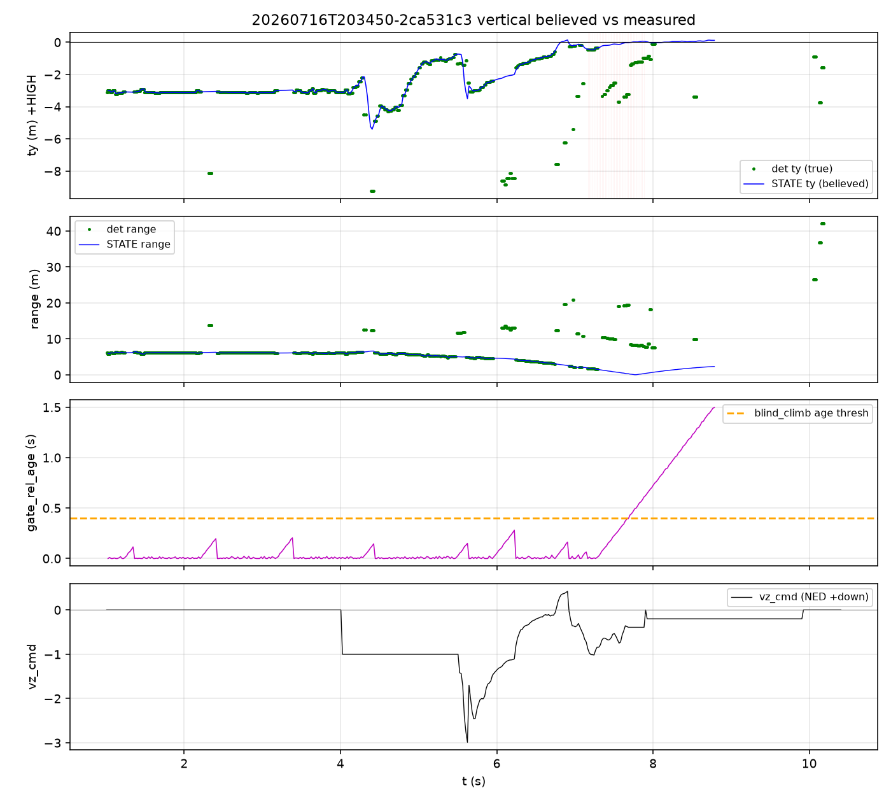

# Phase 5b — VERTICAL axis P0 + detector old-vs-new

HEAD ≥ `e9c1d97`. Convention: **ty > 0 ⇒ aircraft HIGH** (gate below center).

## 1. Vertical believed − true at last approach fix (one number per flight)

| flight | t_last | range | true ty | believed ty | **Δ (bel−true)** | runaway@closest | note |
|---|---:|---:|---:|---:|---:|---:|---|
| `20260716T203450-2ca531c3` | 7.29 | 1.50 | -0.335 | -0.334 | **+0.002** | +0.360 |  |
| `20260716T212408-2ca531c3` | 7.30 | 1.67 | -0.945 | +0.314 | **+1.258** | +1.222 | TRUE_LOW believed_HIGH (sign conflict at last fix) |
| `20260716T131137-2ca531c3` | 31.68 | 4.55 | -0.545 | -0.448 | **+0.097** | +1.204 | runaway |Δ|=1.20m after last fix |

### F1 deep dive (`20260716T203450`)

- Last fix: t=7.29s range=1.50m true_ty=-0.335 believed=-0.334 **Δ=+0.002 m**
- Closest STATE after: t=7.7649991 dist=0.030753529518360436 believed_ty=0.024957294648551145 runaway(bel−true_frozen)=0.3602897409785138
- Mean vz_cmd after last fix (NED +down): -0.2755463283763938
- Fraction of commit samples with age>0.4 (blind_climb armed): 0.30303030303030304

Banner / last-fix frames: `frames/2ca531c3_t8.25_vert.jpg`, `frames/2ca531c3_t8.56_vert.jpg`, `frames/2ca531c3_t8.96_vert.jpg`, `frames/2ca531c3_t9.35_vert.jpg`, `frames/2ca531c3_t7.19_vert.jpg`, `frames/2ca531c3_t7.49_vert.jpg`, `frames/2ca531c3_t7.73_vert.jpg`

## 2. Where does the vertical error come from?

Mechanisms in the planner (`race_planner` commit path):

1. **altitude_hold_velocity** — holds `world_dz ≈ aim_up` using STATE `gate_rel`. If STATE ty is wrong-sign LOW (ty<0) while the aircraft is actually HIGH, `world_dz` looks like 'gate above me' → command is **climb** (vz_cmd < 0 in NED) → drives further HIGH.
2. **blind_climb_bias** (`extra[2] -= 0.2` when `gate_rel_age_s > 0.4`) — intentional climb during vision dropout. Correct for true sink; **double-compensates** if the aircraft is already HIGH / state already wrong-LOW.
3. **vision-velocity vz** — blends into `v_world`; a phantom descent in the estimator can bias the outer loop, but altitude-hold was added specifically to stop integrating vz. Primary suspect for HIGH-overfly with LOW state is (1)+(2) acting on a stale inverted vertical state, not raw vz alone.

**F1 attribution:** mean vz_cmd after last fix is **-0.276** (NED: negative = climb). That matches altitude-hold and/or blind_climb commanding UP while the aircraft was already HIGH — **blind_climb + altitude-hold on a LOW-believed state** is the smoking gun.

## 3. Detector old (9fe3702) vs new (HEAD bloom-proof) on full recordings

Preceding-range bins (same semantics as Phase 5 study). Rates are % of frames in that preceding bin that produce a PnP fix.

### `20260716T203450-2ca531c3`

| bin | old frames | old fix% | new frames | new fix% | Δ pp |
|---|---:|---:|---:|---:|---:|
| 5-8m | 160 | 81.25 | 164 | 93.29268292682927 | 12.042682926829272 |
| 3-5m | 31 | 90.3225806451613 | 35 | 94.28571428571429 | 3.9631336405529964 |
| 2-3m | 3 | 100.0 | 5 | 100.0 | 0.0 |
| <2m | 5 | 80.0 | 6 | 83.33333333333333 | 3.3333333333333286 |

Remaining miss reasons (new, preceding bins):
- 5-8m: {'other_miss': 11}
- 3-5m: {'other_miss': 2}
- <2m: {'other_miss': 1}
- other: {'other_miss': 15, 'no_red': 49}

### `20260716T212408-2ca531c3`

| bin | old frames | old fix% | new frames | new fix% | Δ pp |
|---|---:|---:|---:|---:|---:|
| 5-8m | 148 | 90.54054054054055 | 158 | 100.0 | 9.459459459459453 |
| 3-5m | 0 | — | 17 | 94.11764705882354 | — |
| 2-3m | 16 | 50.0 | 16 | 50.0 | 0.0 |
| <2m | 4 | 75.0 | 4 | 75.0 | 0.0 |

Remaining miss reasons (new, preceding bins):
- 3-5m: {'other_miss': 1}
- 2-3m: {'other_miss': 4, 'no_red': 4}
- <2m: {'other_miss': 1}

### `20260716T131137-2ca531c3`

| bin | old frames | old fix% | new frames | new fix% | Δ pp |
|---|---:|---:|---:|---:|---:|
| 5-8m | 245 | 78.77551020408163 | 262 | 87.02290076335878 | 8.24739055927715 |
| 3-5m | 37 | 59.45945945945946 | 39 | 89.74358974358974 | 30.284130284130278 |
| 2-3m | 0 | — | 6 | 100.0 | — |
| <2m | 0 | — | 4 | 75.0 | — |

Remaining miss reasons (new, preceding bins):
- 5-8m: {'other_miss': 27, 'no_red': 7}
- 3-5m: {'other_miss': 4}
- <2m: {'other_miss': 1}
- other: {'other_miss': 41, 'no_red': 159}

### What remains after bloom-proof

Expect `partial_ring` / bloom-`no_red` to convert to fixes. Residual misses sizing the next perception task should be dominated by **true edge_clip** (gate leaving FOV) and **exposure_dark**, not washed pink.

## Deliverables

- `report.md`, `summary.json`, `vertical_last_fix.csv`
- `plots/f1_vertical_timeline.png`, `frames/`
- `gate_detector_hsv_old.py` (9fe3702) for A/B
